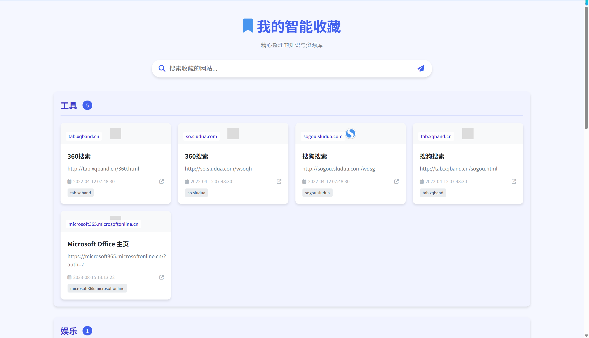
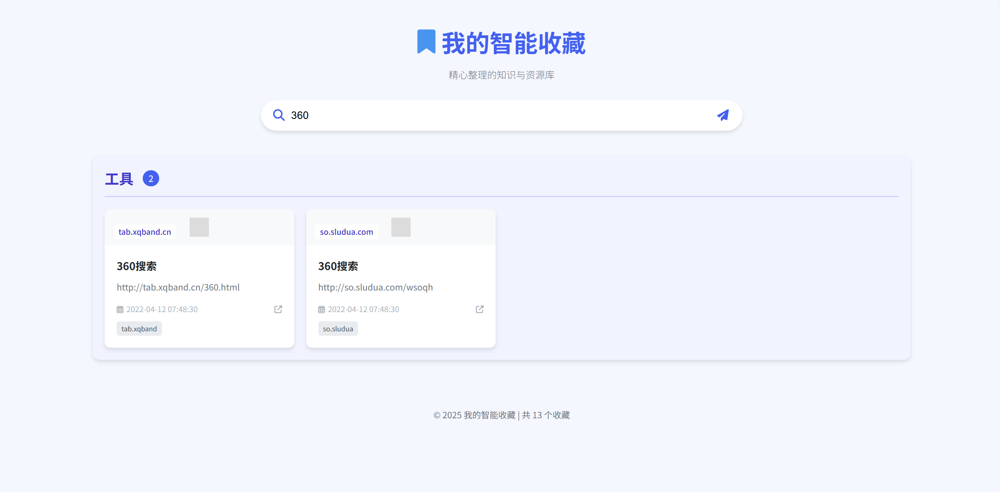
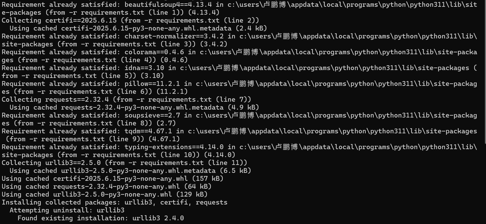
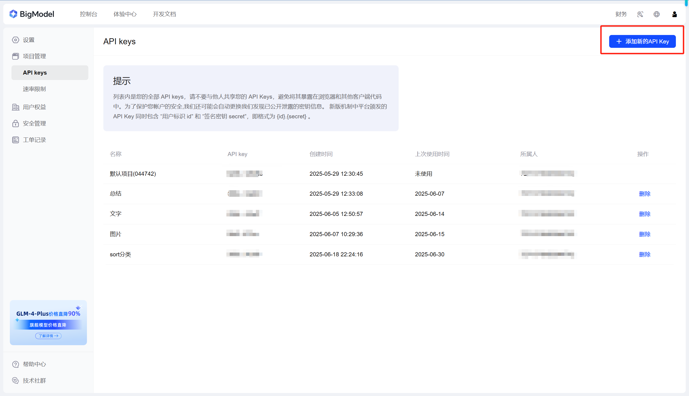
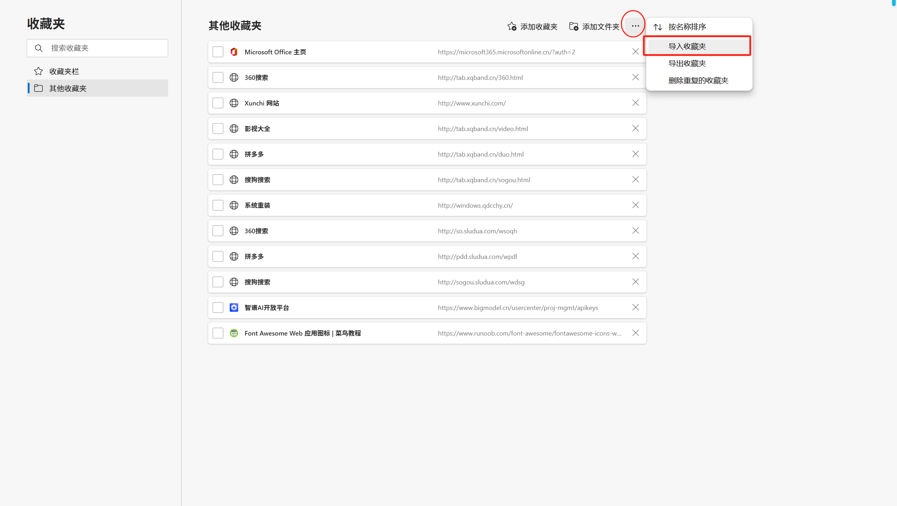
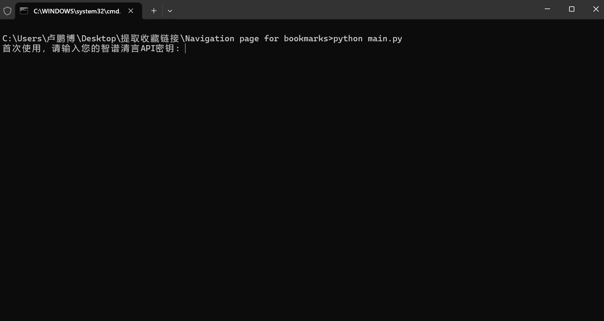
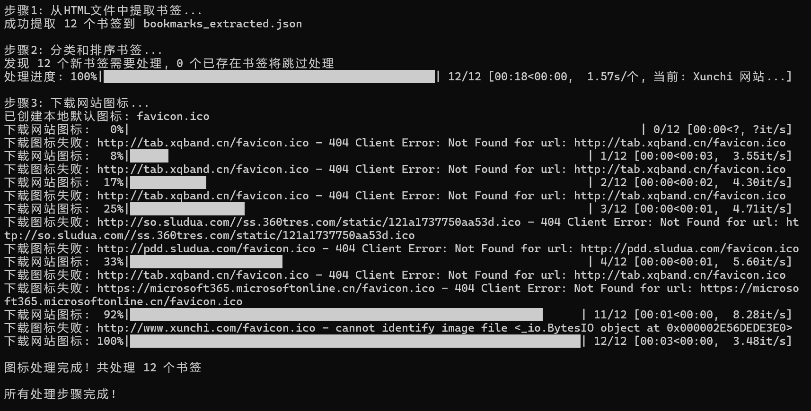
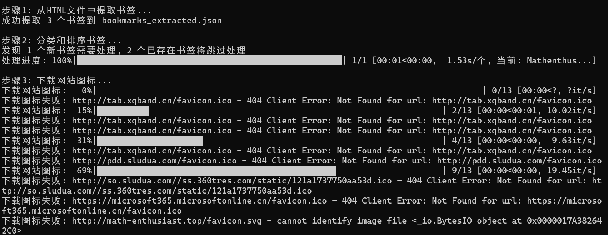

<h1>Navigation Page for Bookmarks 🌐🔖</h1>

<a href="README_zh.md">简体中文</a>  |  ENGLISH

A beautiful and functional navigation page for Edge browser bookmarks with AI-powered categorization.

---

## ✨ Features

- 🧠 AI-powered bookmark categorization
- 🎨 Clean and aesthetic UI design
- ⚡ Quick access to frequently used sites
- 🔄 Automatic detection of new bookmarks
- 🌐 Automatic favicon fetching

## 🖼️ Preview

---

## 🛠️ Usage Guide

### 1. Install Dependencies

Run `requirements.bat` to automatically install required Python libraries:

### 2. Get API Key

Apply for a free API key at [Zhipu AI Platform](https://www.bigmodel.cn/usercenter/proj-mgmt/apikeys):

### 3. Export Edge Bookmarks

1. Enter `edge://favorites` in Edge address bar
2. Click "Export bookmarks" in top-right corner
   

### 4. Run Main Program

1. Copy the exported HTML file to project folder and rename to `bookmarks.html`
2. Double-click `run.bat`
3. Enter your API key when prompted (first run only):
   
4. The program will automatically:
   - Extract bookmark data
   - Perform AI categorization
   - Fetch website favicons
     

### 5. Launch Web Interface

Run `web-ui.bat` to open the navigation page:

---

## 🔄 Subsequent Usage

- New bookmarks will be automatically detected and processed
- Hash comparison prevents duplicate processing
  

> ⚠️ Note: Currently bookmark deletion requires manual operation (auto-sync coming in future versions)

## 📜 License

This project is licensed under the MIT License - see the [LICENSE](LICENSE) file for details

