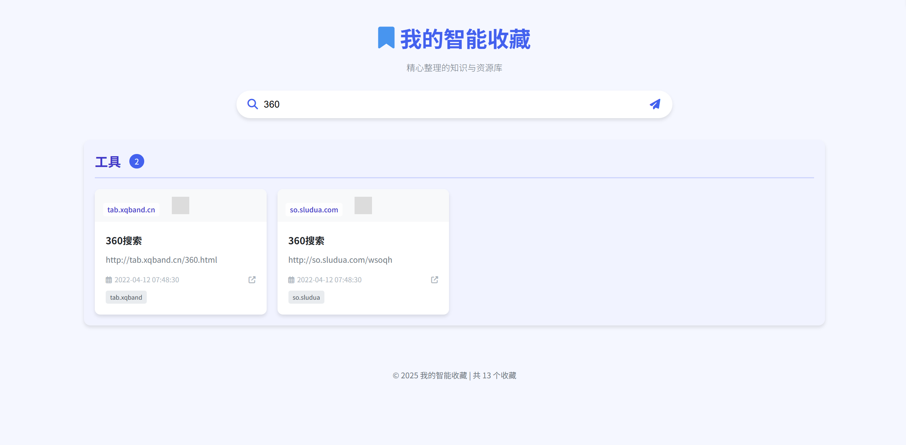
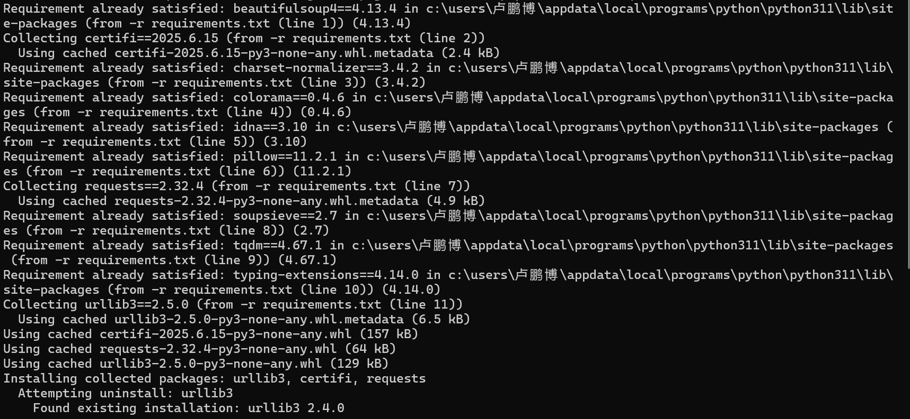

<h1>书签导航页面 🌐🔖</h1>

简体中文  |  <a href="README.md">ENGLISH</a>

为Edge浏览器收藏夹创建美观实用的导航页面，利用AI智能分类您的书签。

---

## ✨ 功能特点

- 🧠 AI智能分类书签
- 🎨 简洁美观的界面设计
- ⚡ 快速访问常用网站
- 🔄 自动更新检测新书签
- 🌐 自动获取网站图标

## 🖼️ 效果预览

---

## 🛠️ 使用方法

### 1. 安装依赖库
双击运行`requirements.bat`自动安装所需Python库：

### 2. 获取API密钥
前往[智谱AI开放平台](https://www.bigmodel.cn/usercenter/proj-mgmt/apikeys)申请免费API密钥：

### 3. 导出Edge收藏夹
1. 在Edge浏览器地址栏输入：`edge://favorites`
2. 点击右上角"导出收藏夹"

### 4. 运行主程序
1. 将导出的HTML文件复制到项目文件夹，重命名为`bookmarks.html`
2. 双击运行`run.bat`
3. 首次使用时输入您的API密钥：

4. 程序将自动执行以下步骤：
   - 提取书签数据
   - AI智能分类
   - 获取网站图标

### 5. 启动Web界面
双击运行`web-ui.bat`自动打开导航页面：

---

## 🔄 后续使用

- 新增书签时，程序会自动检测并只处理新增内容
- 哈希值比对避免重复处理，节省资源

> ⚠️ 注意：目前删除书签需要手动操作，后续版本将实现自动同步

## 📜 许可证

本项目采用MIT许可证 - 详见[LICENSE](LICENSE)文件